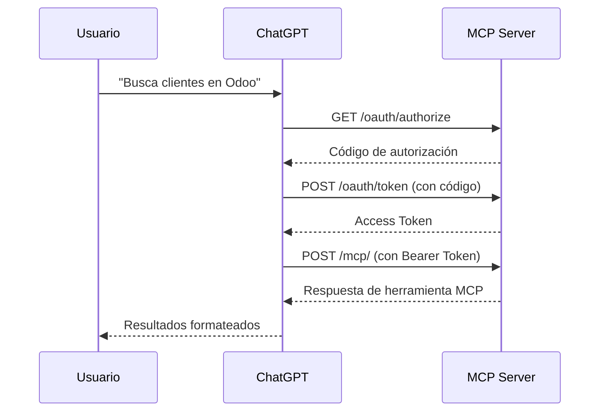

# 🔐 Configuración OAuth para ChatGPT

Esta guía te muestra cómo configurar el servidor MCP Odoo con autenticación OAuth para ChatGPT.

## 📋 Requisitos Previos

- Servidor MCP Odoo corriendo en Replit o servidor público
- Cuenta de ChatGPT Plus o Team (con acceso a conectores personalizados)
- URL pública del servidor (auto-detectada en Replit)

---

## 🚀 Paso 1: Obtener Credenciales OAuth

### Opción A: Obtener automáticamente desde el servidor

1. **Accede al endpoint de credenciales:**
   ```bash
   curl https://[tu-dominio].repl.co/oauth/credentials
   ```

2. **Recibirás:**
   ```json
   {
     "client_id": "chatgpt-odoo-mcp",
     "client_secret": "ABC123XYZ...",
     "authorization_url": "https://[tu-dominio].repl.co/oauth/authorize",
     "token_url": "https://[tu-dominio].repl.co/oauth/token",
     "scopes": ["odoo:read", "odoo:write"],
     "note": "Use estas credenciales para configurar ChatGPT"
   }
   ```

3. **Guarda estas credenciales**, las necesitarás en el siguiente paso.

### Opción B: Verificar en Replit Secrets

El `client_secret` se genera automáticamente al iniciar el servidor. Si necesitas rotarlo, reinicia el servidor.

---

## 🔧 Paso 2: Configurar Conector en ChatGPT

1. **Abre ChatGPT** (versión Plus o Team)

2. **Ve a Configuración → Conectores → Crear Conector**

3. **Configura los valores:**

   **Información Básica:**
   - **Nombre**: `Odoo MCP Server`
   - **Descripción**: `Conector MCP para gestionar Odoo ERP - productos, clientes, ventas, inventario`
   - **Icono**: (opcional, sube un icono de 128x128px)

   **URL del Servidor MCP:**
   ```
   https://[tu-dominio].repl.co/mcp/
   ```
   ⚠️ **Importante**: Incluye el `/` al final de `/mcp/`

   **Autenticación:**
   - Tipo: `OAuth`
   - **Client ID**: `chatgpt-odoo-mcp` (del paso 1)
   - **Client Secret**: `[tu-client-secret]` (del paso 1)
   - **Authorization URL**: `https://[tu-dominio].repl.co/oauth/authorize`
   - **Token URL**: `https://[tu-dominio].repl.co/oauth/token`
   - **Scopes**: `odoo:read odoo:write`

4. **Guarda el conector**

---

## ✅ Paso 3: Probar la Conexión

1. **En ChatGPT, inicia una conversación**

2. **Prueba con un mensaje simple:**
   ```
   Busca los primeros 5 clientes activos en Odoo
   ```

3. **ChatGPT debe:**
   - Solicitar autorización OAuth (primera vez)
   - Redirigir al servidor de autorización
   - Obtener el token de acceso
   - Llamar a la herramienta `odoo_search_read_records`
   - Mostrar los resultados

4. **Si funciona correctamente, verás:**
   ```
   Encontré 5 clientes activos:
   1. Cliente A - cliente@a.com
   2. Cliente B - cliente@b.com
   ...
   ```

---

## 🔍 Flujo OAuth Completo



---

## 🛠️ Troubleshooting

### Error: "Invalid client_id"

**Causa**: El client_id no coincide.

**Solución**:
1. Verifica que usas `chatgpt-odoo-mcp` exactamente
2. Si cambiaste el client_id en el código, actualízalo en ChatGPT

### Error: "Invalid redirect_uri"

**Causa**: ChatGPT intenta redirigir a una URL no autorizada.

**Solución**:
- El servidor acepta cualquier redirect_uri de ChatGPT
- Verifica que la URL del servidor sea correcta

### Error: "Authorization code expired"

**Causa**: El código de autorización expiró (10 minutos).

**Solución**:
- Vuelve a autorizar desde ChatGPT
- El código se genera nuevo cada vez

### Error: "Access token expired"

**Causa**: El token expiró (24 horas).

**Solución**:
- ChatGPT renovará automáticamente usando el refresh_token
- Si falla, vuelve a autorizar

### ChatGPT no encuentra las herramientas

**Causa**: El endpoint MCP no responde correctamente.

**Solución**:
1. Verifica que el servidor esté corriendo:
   ```bash
   curl https://[tu-dominio].repl.co/health
   ```

2. Verifica el endpoint MCP:
   ```bash
   curl https://[tu-dominio].repl.co/mcp/ \
     -H "Authorization: Bearer [access-token]" \
     -H "Accept: application/json"
   ```

---

## 🔐 Seguridad en Producción

### 1. Proteger el endpoint /oauth/credentials

Este endpoint expone el client_secret. En producción:

```python
@app.get("/oauth/credentials")
async def oauth_credentials(auth: dict = Depends(auth_manager.verify_request)):
    # Requiere autenticación admin
    ...
```

### 2. Implementar pantalla de consentimiento

El flujo actual auto-aprueba. En producción, muestra una página HTML:

```python
@app.get("/oauth/authorize")
async def oauth_authorize(...):
    # Mostrar formulario de consentimiento
    return HTMLResponse(consent_form_html)
```

### 3. Almacenamiento persistente

Los tokens están en memoria. En producción, usa Redis o base de datos:

```python
# En oauth.py
oauth_tokens: Dict[str, dict] = {}  # ← Cambiar a Redis

import redis
redis_client = redis.Redis(...)

def store_token(token: str, data: dict):
    redis_client.setex(token, 86400, json.dumps(data))
```

### 4. Rotar client_secret periódicamente

```python
# Agregar endpoint para rotar secret
@app.post("/oauth/rotate-secret")
async def rotate_secret(auth: dict = Depends(require_admin)):
    new_secret = oauth_manager.rotate_client_secret()
    return {"client_secret": new_secret}
```

---

## 📊 Monitoreo OAuth

### Ver tokens activos

Agregar endpoint de monitoreo:

```python
@app.get("/oauth/tokens/active")
async def list_active_tokens(auth: dict = Depends(require_admin)):
    return {
        "count": len(oauth_tokens),
        "tokens": [
            {
                "token": token[:10] + "...",
                "client_id": data["client_id"],
                "expires_at": data["expires_at"],
                "scope": data["scope"]
            }
            for token, data in oauth_tokens.items()
        ]
    }
```

### Logs estructurados

El servidor ya registra eventos OAuth:
- `oauth_authorize_request`
- `oauth_token_issued`
- `oauth_token_refreshed`
- `oauth_authenticated`

Busca en los logs:
```bash
# En Replit, ve a Logs y filtra por "oauth"
```

---

## 🎯 Ejemplos de Uso con ChatGPT

Una vez configurado OAuth, puedes usar ChatGPT como super trabajador de Odoo:

### Ejemplo 1: Consultas

```
Usuario: ¿Cuántos clientes tengo de España?
ChatGPT: [Llama a odoo_search_records con domain España]
         Tienes 45 clientes de España.
```

### Ejemplo 2: Crear registros

```
Usuario: Crea un producto: Laptop Dell, precio $899, código LAP-DELL-001
ChatGPT: [Llama a odoo_create_record]
         ✅ Producto "Laptop Dell" creado con código LAP-DELL-001
```

### Ejemplo 3: Transferencias

```
Usuario: Transfiere 10 laptops del almacén central a la tienda norte
ChatGPT: [Llama a odoo_search_records para ubicaciones]
         [Llama a odoo_create_record para transferencia]
         ✅ Transferencia INT/00123 creada
```

### Ejemplo 4: Reportes

```
Usuario: Muéstrame el inventario por ubicaciones y envíalo a mi email
ChatGPT: [Llama a odoo_search_read_records]
         [Formatea datos]
         Aquí está el inventario... ¿Quieres que lo envíe por email?
```

---

## 📝 Notas Importantes

1. **Tokens en memoria**: Los tokens OAuth se almacenan en memoria y se pierden al reiniciar el servidor. En producción, usa Redis o PostgreSQL.

2. **Client secret único**: Cada instancia del servidor genera su propio client_secret. Si tienes múltiples servidores, sincroniza el secret.

3. **Auto-detección de URL**: En Replit, el servidor detecta automáticamente la URL pública desde `REPLIT_DOMAINS`. En otros entornos, configura `SERVER_URL` en variables de entorno.

4. **Scopes**: Actualmente los scopes son informativos. Puedes implementar validación granular de permisos basada en scopes.

5. **Refresh tokens**: Los tokens se pueden renovar por 24 horas adicionales usando el refresh_token automáticamente.

---

## ✅ Checklist de Configuración

- [ ] Servidor MCP corriendo en URL pública
- [ ] Credenciales OAuth obtenidas desde `/oauth/credentials`
- [ ] Conector creado en ChatGPT con OAuth
- [ ] Authorization URL configurada correctamente
- [ ] Token URL configurada correctamente
- [ ] Scopes agregados: `odoo:read odoo:write`
- [ ] Prueba realizada con búsqueda de clientes
- [ ] ChatGPT puede autenticarse y llamar herramientas MCP

---

## 🆘 Soporte

Si tienes problemas:

1. **Revisa logs del servidor** en Replit → Logs
2. **Verifica el health check**: `curl https://[dominio].repl.co/health`
3. **Prueba OAuth manualmente** con curl (ver sección Troubleshooting)
4. **Verifica que Odoo esté accesible** desde el servidor

**Flujo de depuración:**
```bash
# 1. Verificar servidor
curl https://[dominio].repl.co/

# 2. Obtener credenciales
curl https://[dominio].repl.co/oauth/credentials

# 3. Simular autorización
curl "https://[dominio].repl.co/oauth/authorize?response_type=code&client_id=chatgpt-odoo-mcp&redirect_uri=https://chatgpt.com/oauth/callback"

# 4. Intercambiar código por token
curl -X POST https://[dominio].repl.co/oauth/token \
  -H "Content-Type: application/json" \
  -d '{
    "grant_type": "authorization_code",
    "code": "[codigo-del-paso-3]",
    "client_id": "chatgpt-odoo-mcp",
    "client_secret": "[tu-secret]",
    "redirect_uri": "https://chatgpt.com/oauth/callback"
  }'

# 5. Usar token para llamar MCP
curl https://[dominio].repl.co/mcp/ \
  -H "Authorization: Bearer [access-token]" \
  -H "Accept: application/json" \
  -d '{"jsonrpc":"2.0","method":"tools/list","params":{},"id":1}'
```

---

¡Listo! Ahora ChatGPT puede acceder a Odoo de forma segura usando OAuth 2.0. 🎉
